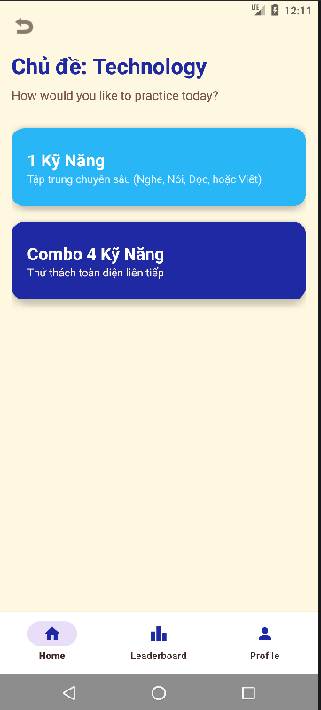
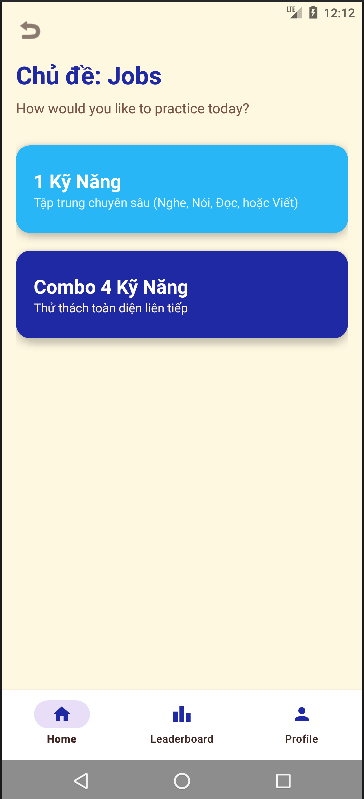
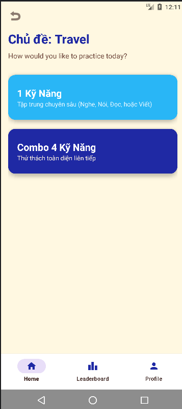
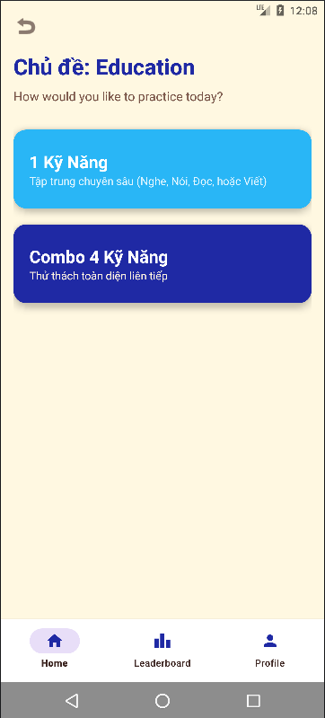
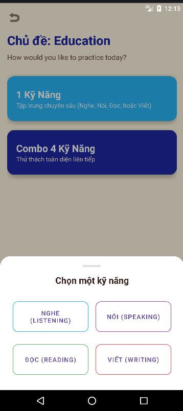
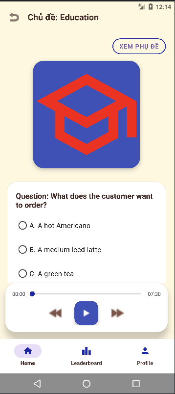

Màn hình chờ của ứng dụng
   
   
   
 Màn hình chính
 

Màn hình khi chọn 1 trong 4 chủ đề: Education, Technology, Travel, và Job

 
 
 
 

    
Màn hình lựa chọn luyện tập 1 kĩ năng hoặc 4 kĩ năng

   
Màn hình khi chọn luyện tập kĩ năng Nghe (Listening)

